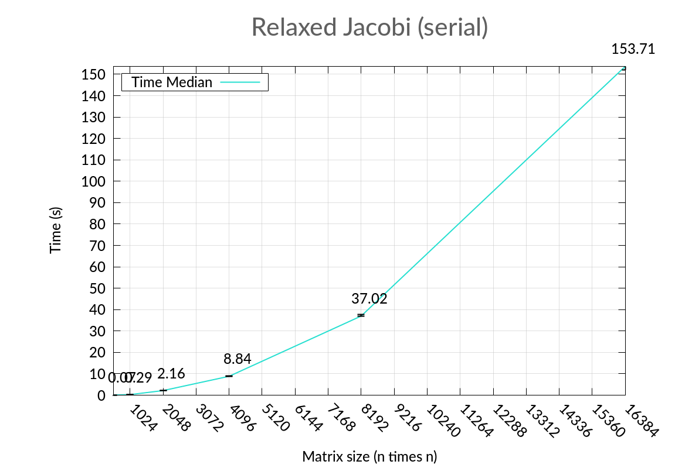

# Jacobi Relaxation in MPI-C


## Table of contents

- [Jacobi relaxation in MPI-C](#jacobi-relaxation-in-mpi-c)
  - [Introduction](#introduction)
  - [Parallelization](#parallelization)
    - [Implementation](#implementation)
  - [Programs schema](#program-schema)
  - [Build](#build)
    - [Dependencies](#dependencies)
    - [Instructions](#instructions)
    - [Execution](#execution)
      - [Deploy](#deploy)
  - [Benchmarking](#benchmarking)
    - [Specifications](#specifications)
    - [Sequential execution](#sequential-execution)
    - [Parallel execution](#parallel-execution)
        - [Strong scaling](#strong-scaling)
        - [Weak scaling](#weak-scaling)
  - [Conclusions](#conclusions)
  - [Credits](#credits)

## Introduction

This project is provided as a possible solution to perform parallel Jacobi relaxation, as per '[A simple Jacobi iteration](https://github.com/isislab-unisa/pcpc/tree/master/projects/problems_templates/jacobi)' problem statement.

Without delving into further detail, **Jacobi relaxation** provides the solution of a linear system; as stated into the afore-mentioned problem statement, it is not the best numerical methods but proves as a good chance to learn parallel computation, since with a little bit of tweaking, it can be parrallelised.

[↑ Back to Index ↑](#table-of-contents)

## Parallelization

Looking at the snippet in [problem statement](https://github.com/isislab-unisa/pcpc/tree/master/projects/problems_templates/jacobi#problem-statement), it's clear that _ghosting_ of matrix rows is necessary to iterate in parallel over input matrix.


Let's consider a 8x8 matrix like the one in the above picture to split among four processors: when receiving assignated rows, every processor has to be able to perform the interation that, for every value, depends on the upper and the lower row; that's why first and fourth processor receive one row more while second and third one two rows more (reminder: border elements don't need to be calculated, that's why first and last processors don't receive two rows as well).

Also keep in mind that ghosting has to be consistent among iterations for every processor.

[↑ Back to Index ↑](#table-of-contents)

### Implementation

Once established that this algorithm can indeed be parallelised, let's see how, in practice, this splitting takes place.

The `MPI_Scatter` function allows to evenly split a buffer among processors in the same communication group; however that's not what we need, since we have to _unevenly_ split our base matrix.

The `MPI_Scatterv` functions is what we need: by specifying how many values of declared type each processor has to receive; a little drawback stands in having to also specify _displacement_ in matrix for every processor: fair enough, since we need to ghost matrix rows by specifying overlapping displacements and element counts.

To keep ghost rows updated for each process, a couple of `MPI_Sendrecv` function calls allow processes to give their upper effective row and receive from previous process its lower effective row (vice versa for lower effective row).


This rows swapping strategy among subsequent iterations is a key point for parallelisation of Jacobi relaxed, since it reduces significantly the communication within the cluster; a naïve approach might require the matrix to be scattered and gathered for each iteration, burdening the master with additional communication time and consequently increasing overall execution time.

[↑ Back to Index ↑](#table-of-contents)

## Programs schema

Both serial and parallel version of Jacobi relaxation perform the following operations:

1. create a random values (with seed set to 1) square matrix with given number of rows
2. apply Jacobi relaxation over generated matrix
3. print on screen elapsed time
4. save the _(key, time)_ pair in given output file, where _key_ semantics depends on whether program is sequential or parallel: in the first case, _key = number of rows_, in the latter case, _key = number of processes_

Clearly, in parallel implementation, there are more intermediate steps about distribution and recollection of submatrices to every processor and row exchange among processor at every iteration.

[↑ Back to Index ↑](#table-of-contents)

## Build

### Dependencies

This project has been tested over **Ubuntu 18.04 LTS**, however it should be compatible with any GNU/Linux OS.

To just build the project, following packages are required:
- `make` (it can be found in `build-essential` bundle in Ubuntu APT)
- `clang` (optional, it can be switched in Makefile `CC` variable to any compiler)
- `sed`, `tr`, `cut`, `uniq`, `find` for data manipulation (they should be already provided by Bash)
- `gnuplot` for graph generation from data
- `doxygen` (optional, to build documentation)
- [`moxygen`](https://www.npmjs.com/package/moxygen)* (optional, from NPM, to convert Doxygen documentation into Markdown)

> \* Currently, Moxygen doesn't work as intended. 

Additionally, **OpenMPI v4** installation is required for the build to work out of the box; [official build instructions](https://www.open-mpi.org/faq/?category=building#easy-build) have been provided by **The Open MPI Project**; an attempt to install the [RPM package](https://www.open-mpi.org/software/ompi/v4.0/) via `alien` has been performed with no avail on EC2 instances. Installation from Ubuntu APT (`openmpi-bin` and `libopenmpi-dev` packages) is _strongly_ discouraged.

In order to run the AWS Build Cluster script, it's also required to install the [AWS CLI](https://docs.aws.amazon.com/cli/latest/userguide/installing.html) and the `jq` package.

[↑ Back to Index ↑](#table-of-contents)

### Instructions

Download source packages from last release or clone this repository, then move to `Jacobi-MPI` folder and `make` it:

```bash
user@host:~/.../Jacobi-MPI$ make
```

To save some build time, only utility library and binaries can be built

```bash
user@host:~/.../Jacobi-MPI$ make jacobiutils
...
user@host:~/.../Jacobi-MPI$ make jacobi-serial
...
user@host:~/.../Jacobi-MPI$ make jacobi-parallel
```

[↑ Back to Index ↑](#table-of-contents)

### Execution

Both serial and parallel binaries can be executed on their own: the parameters they take as input are _number of rows_ (matrix is square),_ output file path for results_ and an _optional debug flag_ that is any number but `0`:

```bash
user@host:~/.../Jacobi-MPI/bin$ ./jacobi-*** <dimension> <outputFilePath> [<debugFlag>]
```

where `***` can be both `serial` and `parallel`.

Alternatively, the `run-jacobi.sh` script can be launched in order to produce required results for benchmarking:

```bash
user@host:~/.../Jacobi-MPI$ ./run-jacobi -s/-p -d N
```

where `-s` parameter stands for serial execution, `-p` for parallel execution (beware, only one of them can be provided) and `-d` for number of matrix rows.

[↑ Back to Index ↑](#table-of-contents)

#### Deploy

`run-jacobi.sh` script executed with `-p` parameter deals with creating a cluster of 8 `m4.xlarge` instances via the [AWS Build Cluster Script](https://github.com/isislab-unisa/aws-build-cluster-script/) by ISISLab (that [I parallelized](https://github.com/bissim/aws-build-cluster-script/) to reduce creation time). Each of these instances is created with **Ubuntu Server 18.04 LTS** AMI.

Before cluster creation, AWS credentials have to be updated in `~/.aws/credentials` file; moreover, a key must be generated in EC2 panel in order to communicate with cluster instances by their public IP (this argument is explained with due specificity in AWS Build Cluster script README).

After cluster creation, the `deploy.sh` script is sent to _MASTER_ node to be executed: basically, it propagates itself to other cluster nodes and deals with installation of dependencies.


At the end of deploy phase, when every node returns control to master and master returns to user, the `jacobi-parallel` binary gets remotely executed on _MASTER_, which compiled and distributed the binary in deploy phase.

There is actually a continuous exchange of results file to _reduce_ the three lines of the same execution into a line with key and three times, in the following fashion:

```
(key, t1), (key, t2), (key, t3) --reduce--> (key, t1, t2, t3)
```

However, since the effective dimension of the file is trivial, this continuous exchange of result files doesn't take a toll on the overall execution time.

After the execution of `jacobi-parallel` for strong scaling and weak scaling and retrieving final results files, a call to `state_cluster.sh` script from AWS Cluster Build Script is performed with `stop` argument to stop the cluster; after that, final elaboration of result is performed to generate graphs.

[↑ Back to Index ↑](#table-of-contents)

## Benchmarking

All test reported in this section have been performed over _M4_ instances over AWS EC2, in particular `m4.xlarge` instance type.

For each experiment, every iteration has been repeated three times in order to draw error bars; graph lines have been drawn with _median values_ of this three-times-repeated iterations.

Results data have been saved in `data` directory; automatic gnuplot-generated graphs have been saved in `doc/img` directory.

[↑ Back to Index ↑](#table-of-contents)

### Specifications

The `m4.xlarge` instances have the following specifications, according to [official documentation](https:/aws.amazon.com/ec2/instance-types/):

- 2.3 GHz Intel Xeon® E5-2686 v4 (or 2.4 Intel Xeon® E5-2676 v3) processors
  - 4 vCPUs
- 16 GiB RAM
- 750 Mbps bandwidth

[↑ Back to Index ↑](#table-of-contents)

### Sequential execution

An optional test has been performed on a purely sequential version of Jacobi relaxation to compare it with its parallel implementation on a M4 instance.

Running `jacobi-serial` five times starting from _512_ rows, each time doubling it, we can observe an exponential increase in execution time.

| Dimension |  Time Median  |   Time Min   |   Time Max   |
|:---------:|:-------------:|:------------:|:------------:|
|     512   |    0.072773   |    0.071476  |    0.072957  |
|    1024   |    0.289759   |    0.287860  |    0.294446  |
|    2048   |    2.163317   |    2.145097  |    2.185641  |
|    4096   |    8.843120   |    8.804099  |    8.984568  |
|    8192   |   37.019812   |   36.923926  |   37.782221  |
|   16384   |  153.712954   |  152.012261  |  155.175556  |

Execution growth can be clearly observed in graph representation of the above table.



Such a growth prevents us from considering serial solution in any real scenario.

[↑ Back to Index ↑](#table-of-contents)

### Parallel execution

To check for effective utility of using a parallelised version of Jacobi relaxed, the program behaviour has to be observed when number of processor and problem size grow.

[↑ Back to Index ↑](#table-of-contents)

#### Strong scaling

With **strong scaling** test, we check how program scales by increasing number of active processors by _keeping the problem size fixed_.

Running `jacobi-parallel` with 16386 rows and starting from 2 processors, each time doubling it, we can observe that execution time drops significally.

| Processors | Time Median |   Time Min  |   Time Max  |
|:----------:|:-----------:|:-----------:|:-----------:|
|      2     | 168.846332  | 168.815632  | 168.951987  |
|      4     |  85.624909  |  84.788233  |  86.246480  |
|      8     |  48.842349  |  48.708502  |  48.899519  |
|     16     |  33.960075  |  33.406885  |  34.003454  |
|     32     |  28.414192  |  28.394191  |  28.981332  |

By increasing the number of processors with the same problem size, execution time exponentially drops significantly: with 16 processors, a consistent benefit can be already appreciated, with no actual need to use 32 processors.


[↑ Back to Index ↑](#table-of-contents)

#### Weak scaling

What happens if both problem size and number of processors increase, keeping the work per processor fixed?

Running `jacobi-parallel` starting from _2_ processors and _512_ rows, each time doubling both, we can observe that, compared to sequential execution, execution time increases _linearly_.

| Processors | Time Median |  Time Min  |  Time Max  |
|:----------:|:-----------:|:----------:|:----------:|
|      2     |   0.113224  |  0.113042  |  0.114272  |
|      4     |   0.239395  |  0.239152  |  0.246495  |
|      8     |   0.696980  |  0.694002  |  0.700949  |
|     16     |   1.760326  |  1.738949  |  1.762707  |
|     32     |   5.102617  |  5.088713  |  5.110391  |

As we can see from the graph below, there's a significant improvement in keeping the work per processor fixed increasing number or processors as much as the problem size, dropping from 37 seconds required to process a 8192x8192 matrix to 5 seconds with 32 cores; however, the execution time for 32 cores is slightly higher than ain ideal value: this is mainly due to communication overhead that is neither significant nor ignorable.


[↑ Back to Index ↑](#table-of-contents)

## Conclusions

Even though, as stated earlier, Jacobi relaxation isn't the best solution to solve the numerical problem of a linear system, it stands as an example of how much a parallelisable algorithm benefits from parallel execution.

[↑ Back to Index ↑](#table-of-contents)

## Credits

Credits go to:
- **Carmine Spagnuolo** PhD (@spagnuolocarmine) and **Sergio Guastaferro** (@labgua) for [AWS Build Cluster Script](https://github.com/isislab-unisa/aws-build-cluster-script), which [I took the chance to furtherly improve](https://github.com/bissim/aws-build-cluster-script), to save me precious time into creating an AWS EC2 cluster
- [**Mauro Leone**](http://mleone20.it) (@mleone20) for its technical support for Bash and AWS EC2
- **Claudia Pipino** (@pipinoclaudia) and **Mariangela Petraglia** (@MaryPet91) for their technical and moral support
- **Nello Carotenuto** (@NelloCarotenuto) for its sharp insight over security groups in AWS EC2 that saved me hours of painful headaches
- [StackExchange network](https://stackexchange.com) for helping me to solve several issues

[↑ Back to Index ↑](#table-of-contents)
